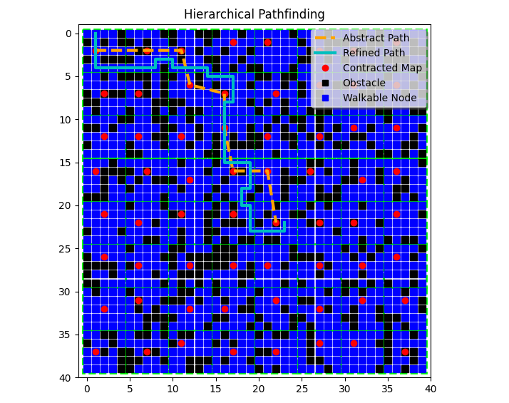
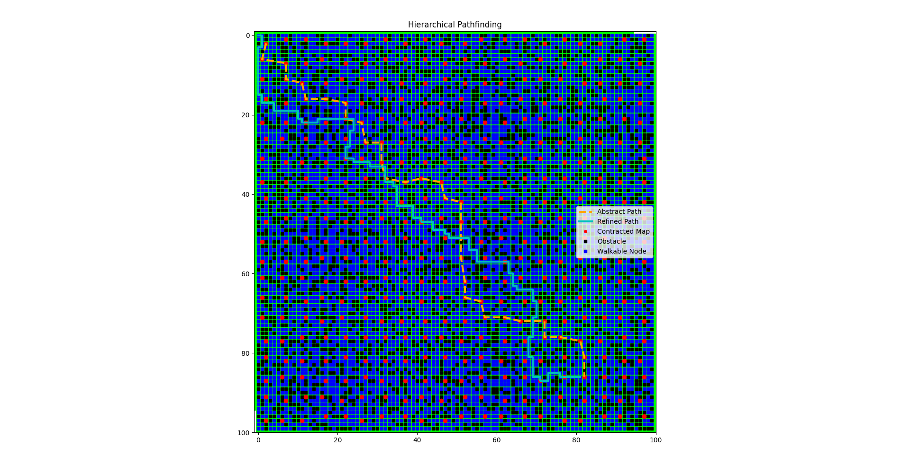

# Hierarchical Pathfinding in Grid-based Environments

## Overview
This project implements a **Hierarchical Pathfinding Algorithm** in a grid-based environment. The approach combines **low-level A* search** on the grid with **high-level abstract planning** over clustered regions, enabling efficient pathfinding in large maps with obstacles.

## Features
- **Grid Representation:** Nodes with randomly assigned movement costs and obstacles.
- **Clustering Mechanism:** Fixed-size clusters for abstraction.
- **Low-Level Pathfinding:** A* search algorithm on the detailed grid.
- **High-Level Pathfinding:** A* search on an abstracted graph of cluster centers.
- **Visualization:** Matplotlib-based plotting of grids, clusters, and paths.

## How It Works
1. **Grid Creation**
   - A 40x40 grid is generated where each node has a random movement cost.
   - Some nodes are marked as obstacles (impassable).

2. **Partitioning into Clusters**
   - The grid is divided into fixed-size clusters (default: 5x5 blocks).
   - Each cluster is represented as a **Supernode** with an average cost and a computed center.

3. **Abstract Graph Construction**
   - Clusters are connected in a graph, where edges represent Euclidean distances between cluster centers.

4. **Pathfinding**
   - **Abstract Level:** A* runs on the cluster graph to find a rough path.
   - **Detailed Level:** A* refines the path within the grid to find an exact route.

## Usage
### Requirements
Ensure you have the following Python libraries installed:
```bash
pip install numpy matplotlib
```

### Running the Program
Run the Python script:
```bash
python pathfinding.py
```

### Output
- The program selects a **random start and goal node** (ensuring they are walkable).
- It first computes an **abstract path** using clusters.
- Then, it refines the path using **low-level A* search**.
- Finally, it **visualizes** the grid, obstacles, clusters, and paths.

#### Small Grid



#### Big Grid


